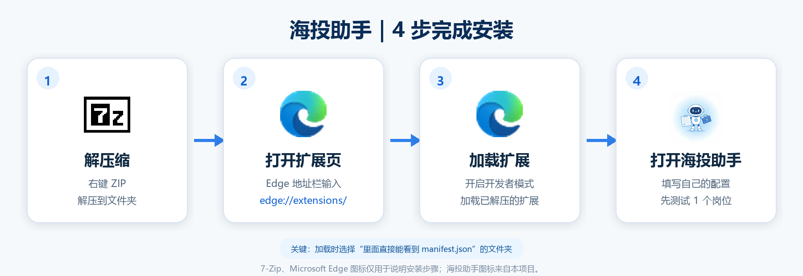

# 海投助手 v0.4.7 安装使用教程

适用浏览器：Microsoft Edge、Google Chrome。

这是开发者模式扩展，不是 BOSS 直聘官方产品。第一次使用请只测试 1 个岗位，确认无误后再逐步使用。

## 安装流程总览

图中的 7-Zip、Microsoft Edge 图标仅用于说明安装步骤，相关商标归各自权利人所有。

## 一、解压文件

1. 收到 ZIP 后，右键选择“全部解压”或“解压到当前文件夹”。
2. 不要直接在压缩包里加载扩展。
3. 打开解压后的文件夹，确认能直接看到：
   - `manifest.json`
   - `src` 文件夹
   - `icons` 文件夹
   - `README.md`
4. 如果只看到另一个同名文件夹，请再进入一层；浏览器需要选择直接包含 `manifest.json` 的目录。

## 二、安装到 Edge 或 Chrome

### Edge

1. 地址栏输入 `edge://extensions/`。
2. 开启“开发人员模式”。
3. 点击“加载解压缩的扩展”。
4. 选择直接包含 `manifest.json` 的“海投助手”文件夹。

### Chrome

1. 地址栏输入 `chrome://extensions/`。
2. 开启“开发者模式”。
3. 点击“加载已解压的扩展程序”。
4. 选择直接包含 `manifest.json` 的“海投助手”文件夹。

安装成功后，扩展卡片应显示“海投助手”和版本 `0.4.7`。如果电脑中还启用了其他 BOSS 自动投递扩展，请先关闭，避免两个扩展同时发送图片或文字。

## 三、首次配置

点击浏览器工具栏里的“海投助手”图标，打开右侧栏。

### 1. 简历图片

- 点击“选择文件”，上传自己的图片版简历。
- 图片预览出现后才代表已经保存。
- 浏览器重新加载后，文件选择框可能重新显示“未选择文件”，这是浏览器安全机制；只要下方仍有图片预览，就不需要重复上传。
- 如果没有预览，请重新选择图片。

### 2. 简历文字

- 用于 AI 岗位筛选和生成针对性自我介绍。
- 建议填写技能、经历、教育背景、到岗时间和可接受条件。
- 不启用 AI 时可以留空。

### 3. 无 AI 自我介绍

- 未接入 DeepSeek 时，填写完成后会原样发送。
- 输入框里的灰色示例只是提示，不是已经填写的内容。
- 可以照着示例写，也可以完全自己写。
- 如果文字仍含 `【姓名】`、`【职位】` 等占位符，插件不会发送。
- 留空时不会发送默认文字；有简历图片则只发图片。

### 4. 岗位关键词

- 必填，一行一个职位，也支持逗号、顿号分隔。
- 例如用户可以按自己的方向填写“行政文员”“资料员”或其他职位；插件不预设职业。

### 5. 本地筛选词

- “加分词”可留空，留空时自动使用岗位关键词。
- “排除词”按自己的要求填写，例如不希望看到的岗位类型。
- 这些词只影响本地筛选，不会作为消息发送给招聘方。

### 6. 城市和数量

- 城市留空时按全国搜索；也可以填写一个城市，例如“深圳”或“北京”。
- 每个关键词默认收集 5 个岗位，允许范围为 1–20。
- 点击“保存配置”。

## 四、可选：启用 DeepSeek AI

1. 打开侧栏顶部“AI增强（可选）”。
2. 开启“启用 AI增强”。
3. 填写自己的 DeepSeek API Key。
4. 点击“测试连接”，看到“连接成功”后再使用。
5. 同时填写“简历文字”，AI 才能根据简历和岗位 JD 进行筛选并生成自我介绍。

API Key 请从 DeepSeek 官方平台获取，不要分享给别人，也不要提交到 GitHub。当前公开版只直接支持 DeepSeek。

## 五、开始找岗位

1. 登录 BOSS 直聘网页版。
2. 打开海投助手侧栏，确认配置已保存。
3. 点击“开始找岗位”。
4. 插件会按关键词打开搜索页、收集岗位并筛选。
5. 等待进入审核阶段，不要同时手动快速切换多个 BOSS 页面。

## 六、审核与投递

1. 在审核列表查看岗位名称、公司、薪资和匹配原因。
2. 只勾选自己确认过的岗位。
3. 第一次只勾选 1 个岗位。
4. 点击“开始投递”。
5. 插件会依次执行：打开岗位详情 → 建立沟通 → 进入对应聊天 → 发送简历图片 → 发送可选自我介绍 → 验证页面结果。
6. 单轮最多处理 5 个岗位。

### 发送结果

| 条件 | 结果 |
| --- | --- |
| AI、API Key、简历文字完整 | 生成并安全检查岗位自我介绍 |
| 未启用 AI，但无 AI 自我介绍已填写完成 | 原样发送用户填写的文字 |
| 没有有效文字，但有简历图片 | 只发送一张简历图片 |
| 图片和有效文字都没有 | 不联系招聘方，安全停止 |

同一会话已经存在自己发送的图片时，插件会停止再次上传并提示人工确认。

## 七、常见问题

### 修改代码或换版本后没有变化

打开 `edge://extensions/` 或 `chrome://extensions/`，点击海投助手卡片上的“重新加载”，然后关闭旧侧栏再重新打开。

### 发了两张简历图片

先检查是否同时启用了其他 JobCopilot、BOSS助手或旧版海投助手。只保留一个扩展启用。当前 v0.4.7 有会话图片检查和 V6 发送锁，但多个不同扩展仍可能同时操作页面。

### 没有发送文字

检查以下任一条件是否成立：

- AI 已启用、API Key 有效，并填写了简历文字；
- “无AI自我介绍”已经填写，且没有任何 `【占位符】`。

如果两项都不成立，插件设计上只发送简历图片。

### 找不到岗位或城市不正确

确认岗位关键词不是灰色提示文字；城市请填写支持的常用城市，或留空按全国搜索。

### 出现验证码、405 或异常页面

立即停止，不要绕过验证，也不要继续批量操作。等待账号和页面恢复后再人工确认。

## 八、隐私与安全

- API Key、简历和岗位记录保存在浏览器扩展本地存储中。
- 开启 AI 后，简历文字和岗位信息会发送给 DeepSeek。
- 投递时，简历图片和通过检查的自我介绍会发送给对应招聘方。
- 项目没有自建中转服务器、广告或遥测。
- 使用者应自行遵守 BOSS 直聘规则、当地法律及招聘沟通规范。

更多信息见项目根目录的 `PRIVACY.md`。
